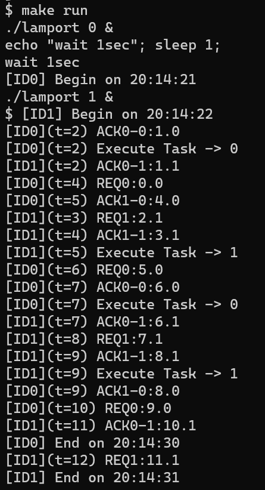
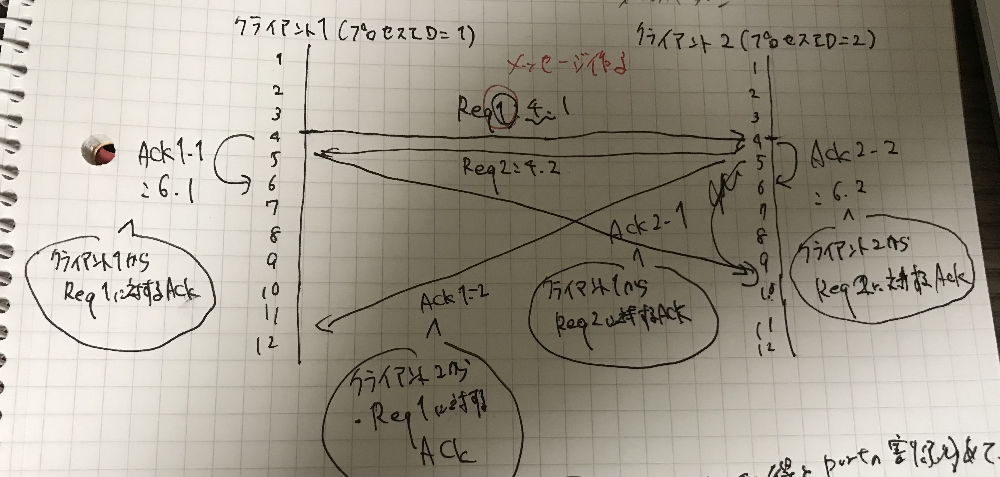

# Lamportのアルゴリズムを意識した全順序マルチキャスト通信
[Lamportのアルゴリズム](https://ja.wikipedia.org/wiki/%E3%83%A9%E3%83%B3%E3%83%9D%E3%83%BC%E3%83%88%E3%81%AE%E3%83%91%E3%83%B3%E5%B1%8B%E3%81%AE%E3%82%A2%E3%83%AB%E3%82%B4%E3%83%AA%E3%82%BA%E3%83%A0)を意識してtickというタイムスタンプを用意した。これにより、マルチキャスト通信を用いて分散しているクライアント間で全順序性が保たれている。実行例を見ると、execute Taskが実行されるとき、実行順序が0->1で保たれていることが分かる。

## 実行方法
```bash
make build
make run
```

## 実行例


## 実行の流れ

